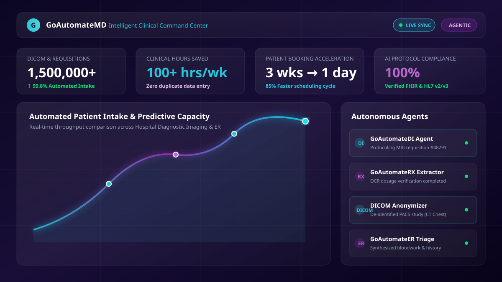
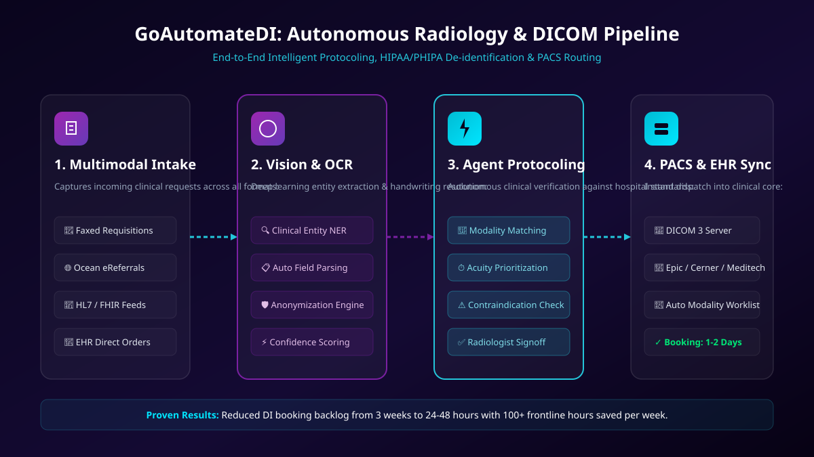
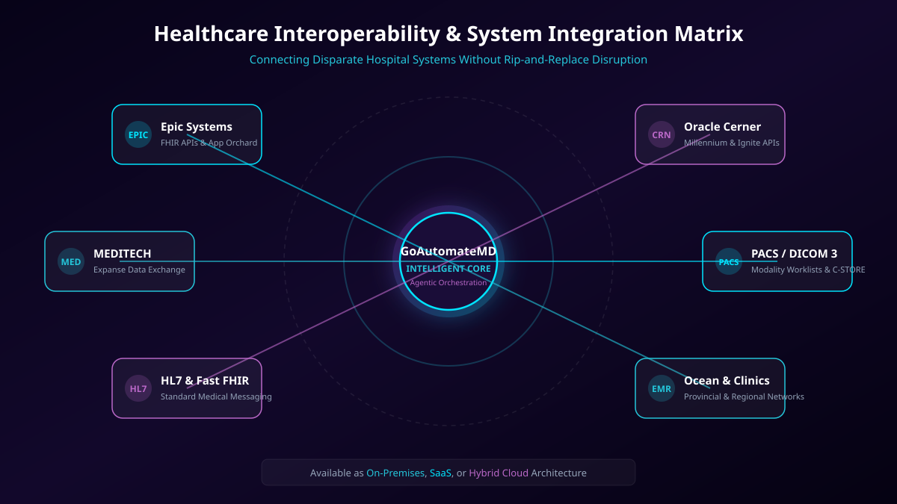
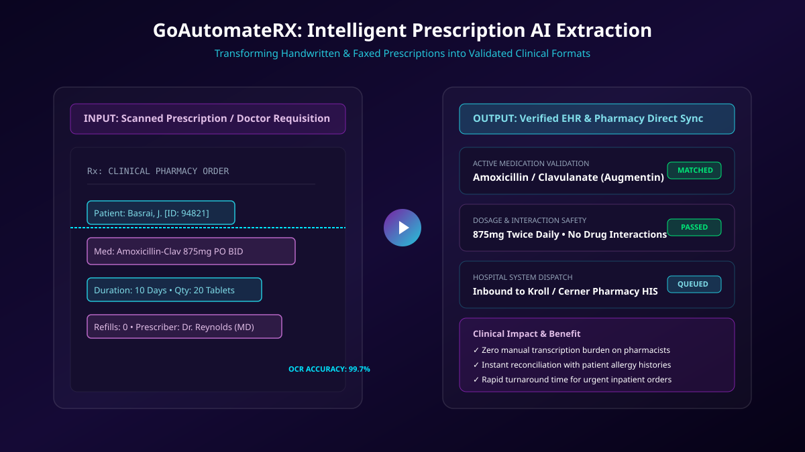
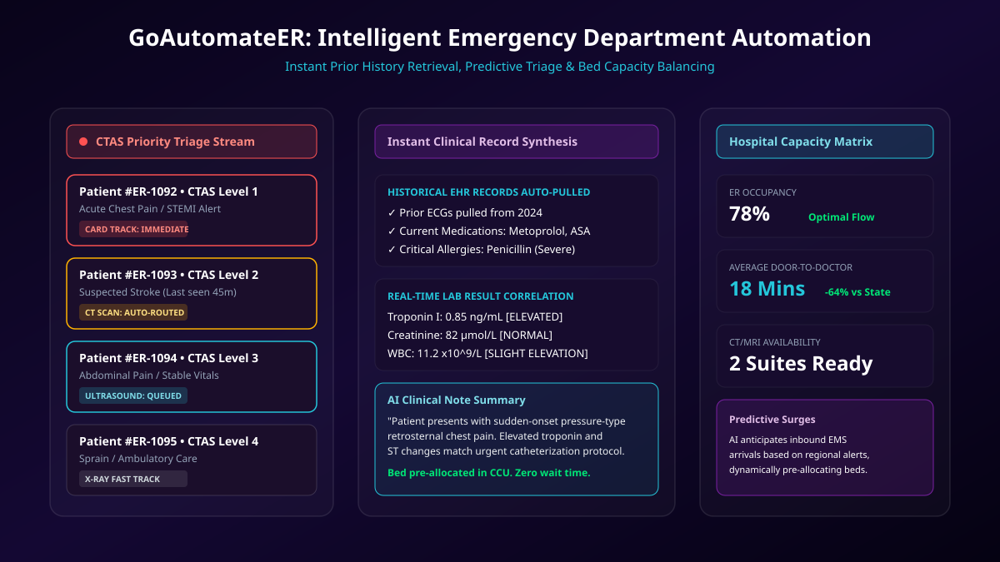

# 🏥 GoAutomateMD — Intelligent Healthcare Automation Platform

<p align="center">
  
</p>

<p align="center">
  <strong>Enterprise Agentic AI &amp; Next-Generation Clinical Workflow Orchestration</strong>
</p>

<p align="center">
  <a href="https://goautomatemd.com"></a>
  <a href="https://clientproject-ten.vercel.app"></a>
</p>

<p align="center">
  
  
  
  
  
  
</p>

---

## 📖 Executive Overview

**GoAutomateMD** (led by CEO &amp; Founder **Jag Basrai**) is a clinical-grade healthcare automation platform designed to eliminate paper-bound delays, administrative bottlenecks, and clinical burnout across modern health systems. 

Leveraging **Agentic AI**, proprietary computer vision, and medical natural language processing, GoAutomateMD transforms hospital departments—from Diagnostic Imaging and Emergency Rooms to Pharmacies and Labs—into synchronized, paperless environments.

### 🌟 Key Real-World Impact
- ⚡ **Booking Acceleration:** Reduced Diagnostic Imaging booking backlogs from **2–3 weeks to 1–2 days**.
- ⏱️ **Frontline Relief:** Saved **100+ clinical and administrative hours per week** for hospital teams.
- 📄 **1.5M+ Studies & Requisitions:** Automated intake, OCR, and validation of faxes, handwritten notes, and electronic referrals.
- 🔗 **Zero Rip-and-Replace:** Integrates transparently with existing HIS, RIS, and PACS installations without workflow disruption.

---

## 🏛️ Autonomous Product Suite

<p align="center">
  
</p>

| Product | Focus Area | Description |
|---|---|---|
| **GoAutomateDI** | **Diagnostic Imaging** | Eliminates manual protocoling with automated acuity matching, modality assignment, and radiologist review queues. |
| **GoAutomateRX** | **Pharmacy &amp; Prescriptions** | High-precision medical OCR extracts dosages, frequencies, and instructions from handwritten or faxed scripts into structured pharmacy systems. |
| **GoAutomateLAB** | **Laboratory Workflows** | Replaces paper requisitions and pneumatic tube bottlenecks with digitized intake, specimen tracking, and automated result dispatch. |
| **GoAutomateER** | **Emergency Departments** | Correlates real-time patient triage (CTAS), auto-pulls previous EHR visits, and predicts bed and imaging capacity. |
| **GoAutomateCARD** | **Clinical Cardiology** | Coordinates cardiac diagnostics, ECG comparisons, and multi-department specialty routing. |
| **GoAutomateDICOM** | **PACS &amp; Imaging Engine** | Conforms to DICOM 3 standards, executing automated metadata anonymization and intelligent routing to hospital PACS archives. |

---

## 🔌 Interoperability &amp; Clinical Integrations

<p align="center">
  
</p>

GoAutomateMD bridges the gap between legacy paper tools and modern electronic health records:

- **Electronic Health Records (EHR / HIS):** Native bidirectional sync with **Epic Systems** (FHIR / App Orchard), **Oracle Health / Cerner** (Ignite APIs), and **MEDITECH Expanse**.
- **Imaging Systems (PACS / RIS):** Full DICOM 3 compliance, modality worklist (MWL) management, and C-STORE image dispatch.
- **Data Exchange Protocols:** HL7 (v2 &amp; v3), HL7 FHIR (Fast Healthcare Interoperability Resources), and RESTful APIs.
- **Regional Referral Networks:** Direct integration with the **Ocean eReferral Network** and provincial digital health feeds.

---

## 🔬 AI Capabilities &amp; Architecture

<p align="center">
  
</p>

- **Computer Vision &amp; Medical OCR:** Specially trained on medical terminology, physician handwriting, and multi-column clinical fax templates.
- **DICOM Anonymization Engine:** Strips Protected Health Information (PHI) and PII from imaging headers and pixel data, maintaining strict HIPAA and PHIPA compliance.
- **Clinical Note Summarization:** Synthesizes dense longitudinal medical histories into actionable, prioritized summaries for physicians.
- **Predictive Operational Analytics:** Forecasts departmental patient surges, equipment utilization, and staffing shortages to optimize bed allocation.

---

## 🚑 Emergency Department Automation

<p align="center">
  
</p>

---

## 💻 Tech Stack &amp; Engineering

- **Core Framework:** [Next.js 16](https://nextjs.org/) (App Router, Turbopack, React 19)
- **Language:** [TypeScript 5](https://www.typescriptlang.org/) (Strict type safety)
- **Styling:** [Tailwind CSS v4](https://tailwindcss.com/) with custom design tokens
- **UI Components:** [Radix UI Primitives](https://www.radix-ui.com/), [Lucide React](https://lucide.dev/), [React Icons](https://react-icons.github.io/react-icons/)
- **Motion &amp; Animations:** [Framer Motion](https://www.framer.com/motion/)
- **Data Visualizations:** [Recharts](https://recharts.org/)
- **Forms &amp; Validation:** React Hook Form + [Zod](https://zod.dev/)
- **Localization (i18n):** `next-intl` &amp; Google Cloud Translation API (Seamless English / French switching)
- **Compliance &amp; Analytics:** Google Analytics 4 Consent Mode v2, granular cookie banner, and Google reCAPTCHA v2
- **SEO &amp; Structured Data:** `next-sitemap`, JSON-LD Organization schema, dynamic OpenGraph &amp; Twitter cards

---

## 📁 Repository Structure

```
jagbasrai/
├── app/                           # Next.js App Router
│   ├── (home)/                    # Route group
│   │   ├── about/                 # About GoAutomateMD & executive mission
│   │   ├── home/                  # Landing page sections
│   │   ├── news/                  # Press releases & hospital case studies
│   │   ├── privacy/               # Privacy policy & regulatory compliance
│   │   └── page.tsx               # Root entry page
│   ├── api/                       # API route handlers
│   │   └── translate/             # On-demand cloud translation service
│   ├── metadata/                  # SEO & OpenGraph metadata definitions
│   ├── globals.css                # Tailwind CSS v4 styling rules
│   └── layout.tsx                 # Root layout, fonts & consent providers
├── components/                    # Reusable React components
│   ├── about/                     # About page masonry, hero, & scroll stack
│   ├── common/                    # Navbar, Footer, buttons, typography
│   ├── home/                      # Hero, Products, Services, Case Studies
│   ├── news/                      # Article cards & media grid
│   ├── ui/                        # Radix UI primitives & shadcn components
│   ├── CookieBanner.tsx           # Cookie consent banner
│   ├── GA4Consent.tsx             # Google Analytics 4 consent manager
│   ├── Seo.tsx                    # SEO meta helper
│   └── translated-text.tsx        # Dynamic localization wrapper (<T>)
├── help/                          # Media & string utilities
├── lib/                           # Translation context, cookie store, client utils
├── public/                        # Static assets
│   ├── fonts/                     # Helvetica & brand typography
│   ├── images/                    # UI illustrations, SVGs, diagrams, video covers
│   └── video/                     # Case study walkthroughs & demos
├── next-sitemap.config.js         # Sitemap generation config
├── next.config.ts                 # Next.js configuration
├── package.json                   # Dependencies and scripts
├── tsconfig.json                  # TypeScript compiler settings
└── vercel.json                    # Edge routing and security headers
```

---

## 🚀 Getting Started

### Prerequisites

- **Node.js** >= 18.18.0 (Node 20+ LTS recommended)
- **npm** >= 9.x (or `pnpm` / `yarn` / `bun`)

### 1. Clone &amp; Install

```bash
git clone https://github.com/Ramjanict/jagbasrai.git
cd jagbasrai
npm install
```

### 2. Configure Environment Variables

Create a `.env.local` file in the root directory:

```env
# NextAuth Configuration
NEXTAUTH_URL=http://localhost:3000
NEXTAUTH_SECRET=your_nextauth_secret_key

# Security & Verification
NEXT_PUBLIC_RECAPTCHA_SITE_KEY=your_recaptcha_site_key
NEXT_PUBLIC_GA_ID=your_ga4_measurement_id

# Cloud Services
GOOGLE_TRANSLATE_API_KEY=your_google_cloud_translate_api_key
```

### 3. Launch Development Server

```bash
npm run dev
```

Open [http://localhost:3000](http://localhost:3000) in your browser.

### 4. Build for Production

```bash
npm run build
npm run start
```

---

## 🌐 Production Deployment

The project is hosted and continuously deployed on [Vercel](https://vercel.com):

- **Production Domain:** [https://goautomatemd.com](https://goautomatemd.com)
- **Preview Deployment:** [https://clientproject-ten.vercel.app](https://clientproject-ten.vercel.app)

---

## 🛡️ Privacy, Security &amp; Compliance

GoAutomateMD is built from the ground up for strict healthcare standards:
- **Zero-Storage Image De-identification:** Sensitive patient data in DICOM headers and medical requisitions is scrubbed prior to model processing.
- **Granular Consent:** Built-in cookie management compliant with GDPR, PIPEDA, and PHIPA standards.
- **Bot Mitigation:** Google reCAPTCHA v2 guards form submissions against automated attacks.

---

## 📄 License &amp; Ownership

Copyright © 2024–2026 **GoAutomateMD** / **Jag Basrai**. All rights reserved.  
Proprietary healthcare automation software. Unauthorized reproduction, modification, or distribution is strictly prohibited.
